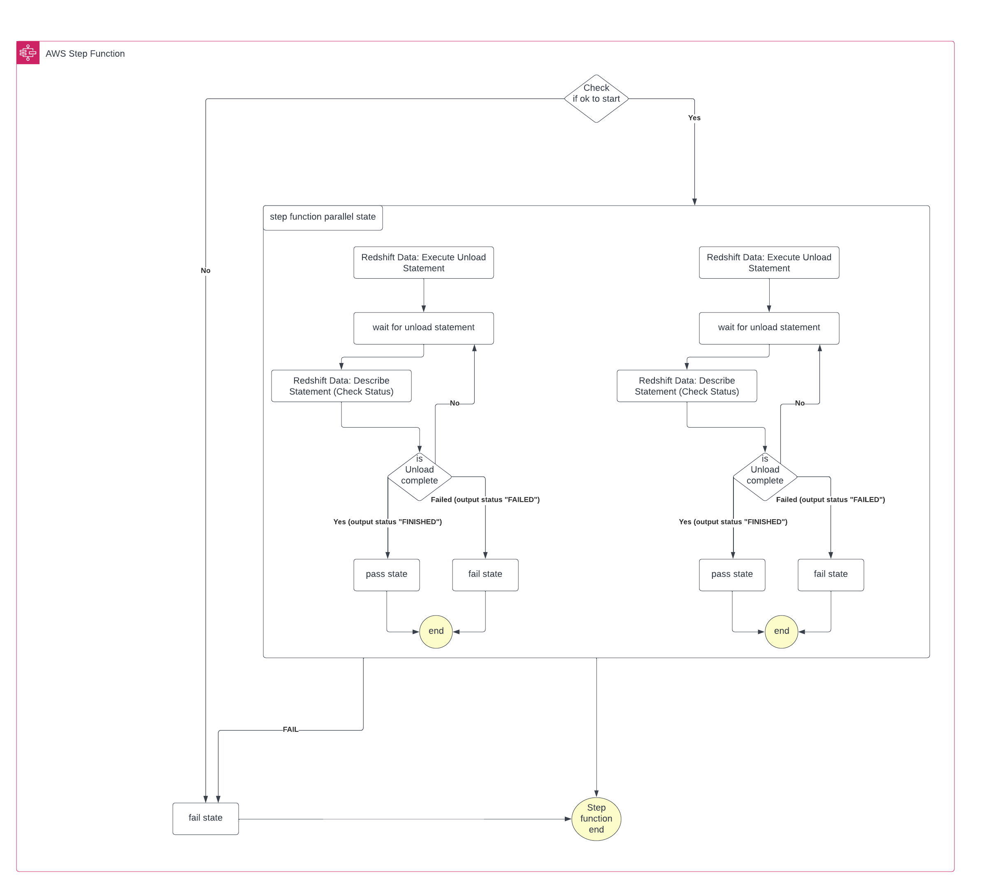

# What is this repo?
This repo has been forked from https://github.com/aws-samples/getting-started-with-amazon-redshift-data-api to expand upon the Redshift ETL process, focussing on the as simple as possible a solution using step functions and the Redshift data API - no Lambdas here!

The step function will execute Redshift operations asynchronously.

## Introduction 

The [Amazon Redshift Data API](https://docs.aws.amazon.com/redshift/latest/mgmt/data-api.html) enables you to efficiently access data from Amazon Redshift with all types of traditional, cloud-native, and containerized, serverless web services-based applications and event-driven applications. This includes, but not limited to, AWS Lambda, Amazon SageMaker, AWS Cloud9 and many other AWS services.

Amazon Redshift Data API simplifies data access, ingest, and egress from the languages supported with AWS SDK such as Python, Go, Java, Node.js, PHP, Ruby, and C++. 

## Architectural Diagram 

### About Redshift Data API

Amazon Redshift Data API by default is asynchronous. This means when executing SQL commands, you can retrieve your results later for up to 24 hours with a generated Query ID. However, you can also configure your code to have your SQL commands run synchronously.  The implementation is demonstrated within the code samples.  

## Other considerations

Passing parameters to the Redshift Data API, and other considerations : [Link](https://docs.aws.amazon.com/redshift/latest/mgmt/data-api.html#data-api-calling-considerations)

## Security

See [CONTRIBUTING](CONTRIBUTING.md#security-issue-notifications) for more information.

## License

This library is licensed under the MIT-0 License. See the LICENSE file.